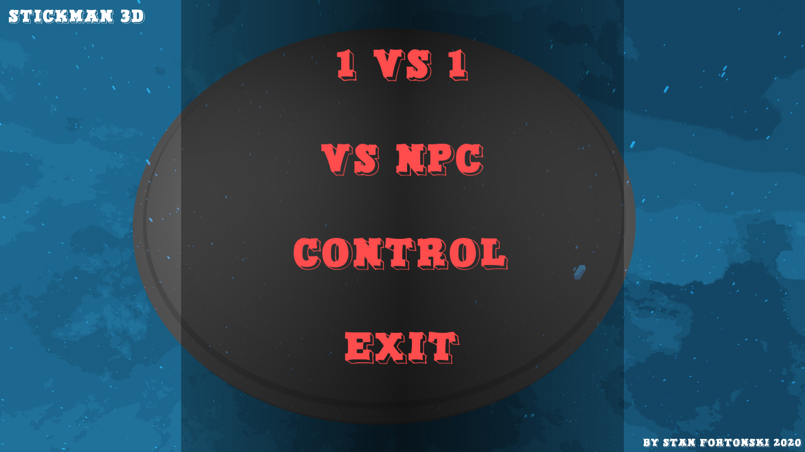
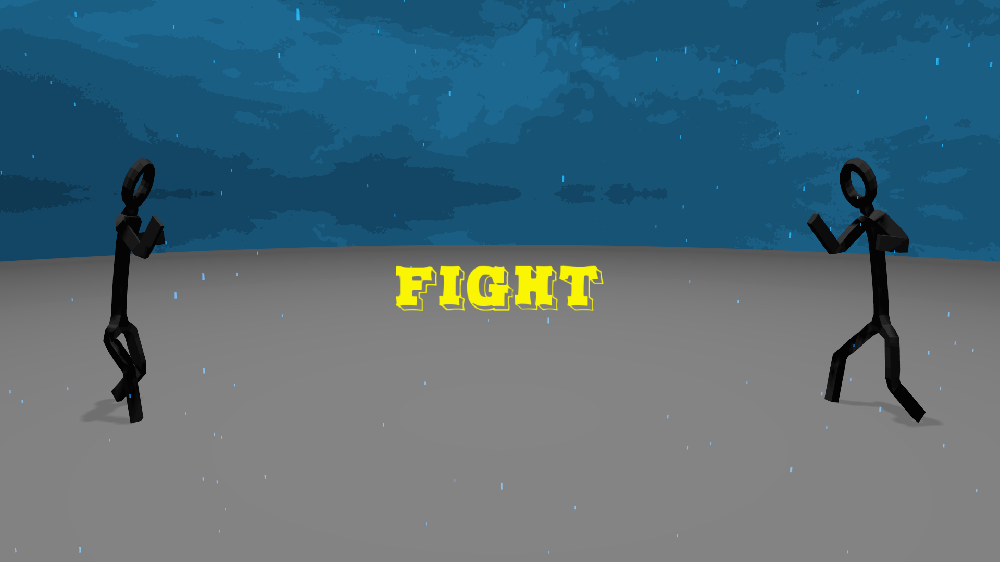
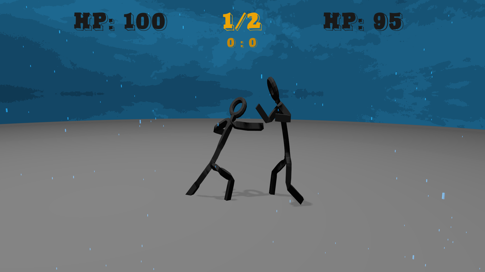
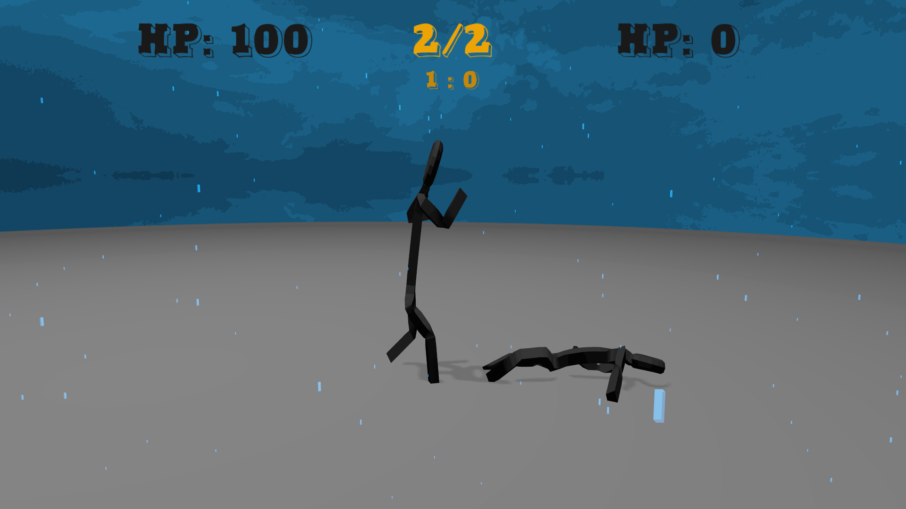
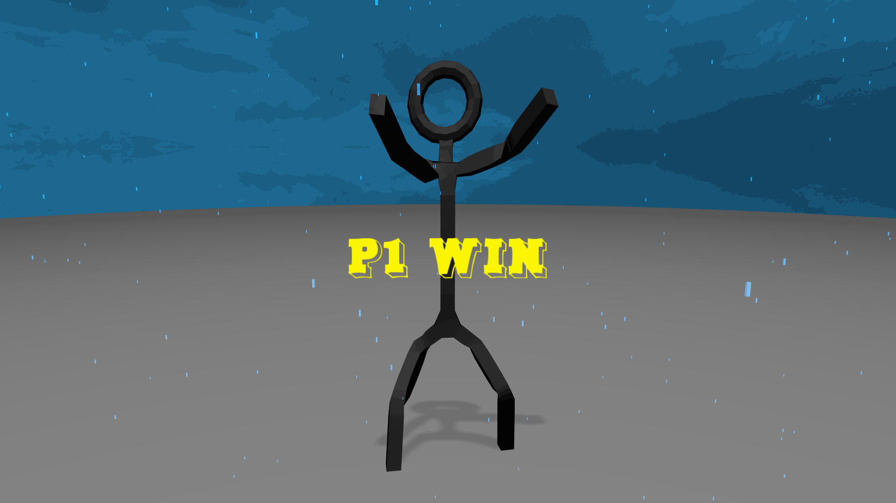

# 🥊 StickMan 3D: First Round

**Nome:** StickMan 3D: First Round

**Descrição:** Jogo de luta 3D onde dois stickmen se enfrentam em rounds de combate. O jogador pode disputar contra outro jogador local (Player vs Player) ou desafiar uma inteligência artificial com personalidade aleatória (Player vs NPC). O jogo apresenta visual estilizado com *cell shading*, efeito de chuva por partículas e iluminação dinâmica com sombras.

---

## 🎬 Gameplay

https://github.com/user-attachments/assets/8ac9b7c6-a07f-4aee-ae6e-191c11fd9034

---

## 🖼️ Screenshots







---

## 🎮 Instruções de Jogabilidade

### Controles — Jogador 1

| Ação | Teclado |
|---|---|
| Mover para frente | `W` ou `D` |
| Mover para trás | `S` ou `A` |
| Soco esquerdo | `R` |
| Soco direito | `T` |
| Chute esquerdo | `F` |
| Chute direito | `G` |
| Defesa contra soco | `C` |
| Defesa contra chute | `V` |
| Pausar | `ESC` |

### Controles — Jogador 2

| Ação | Teclado |
|---|---|
| Mover para frente | `↑` ou `←` |
| Mover para trás | `↓` ou `→` |
| Soco esquerdo | `U` |
| Soco direito | `I` |
| Chute esquerdo | `J` |
| Chute direito | `K` |
| Defesa contra soco | `N` |
| Defesa contra chute | `M` |

### Controle (Joystick)

| Ação | Botão |
|---|---|
| Mover | Analógico esquerdo / D-Pad |
| Soco esquerdo | Botão 0 (A/X) |
| Soco direito | Botão 1 (B/○) |
| Chute direito | Botão 2 (X/□) |
| Chute esquerdo | Botão 3 (Y/△) |
| Defesa contra soco | Botão 5 (RB/R1) |
| Defesa contra chute | Botão 4 (LB/L1) |
| Pausar | Botão 8 (Select/Share) |

---

## 🔧 Funcionalidades Implementadas

---

### 1. 🤖 Inteligência Artificial com Personalidade Aleatória

O NPC adversário recebe uma **personalidade gerada aleatoriamente** a cada partida, definindo seu nível de agressividade, timing de reação e estratégia de luta. A personalidade é composta por seis parâmetros sorteados:

- `hpToDefMode` — nível de HP abaixo do qual o NPC entra em modo defensivo
- `procentageDefOrOff` — probabilidade de defender ao invés de atacar
- `procentageAttackWait` — chance de hesitar antes de atacar
- `procentageWalkWait` — chance de hesitar antes de avançar
- `distanceOffensive` — distância mínima para iniciar ofensiva
- `distanceDefensive` — distância em que recua para se defender

A cada 0,45 segundos, o NPC executa o método `think()`, avalia o HP atual e seleciona a ação mais adequada para o alcance atual:

```cpp
// src/game/NPC.cpp

void NPC::randomPersonality()
{
  hpToDefMode = rand()%40+1;
  procentageDefOrOff = rand()%100+1;
  procentageWalkWait = rand()%30+1;
  procentageAttackWait = rand()%20+1;
  distanceOffensive = (float)(rand()%50)/100.0f + 0.56f;
  distanceDefensive = (float)(rand()%40)/100.0f + 0.75f;
}

void NPC::think()
{
  double time = glfwGetTime();
  if (time >= timeToEndWork)
  {
    timeToEndWork = time + DELAY_TIME;
    if (getHP() < hpToDefMode)
      playDefensive();
    else playOffensive();
  }
  chooseWork();
}

void NPC::playOffensive()
{
  if (isRangeOffensive())
  {
    int whatToDo = rand()%100+1;
    if (procentageDefOrOff <= whatToDo)
    {
      if (!wait(procentageAttackWait))
        randomAttackBasedOnRange();
    }
    else defensive();
  }
  else
  {
    if (!wait(procentageWalkWait))
      work = 0; // avança em direção ao jogador
  }
}

void NPC::randomAttackBasedOnRange()
{
  if (isRightKickRange())
    work = rand()%4+1;       // qualquer ataque
  else if (isLeftPunchRange())
    work = rand()%3+1;       // soco ou chute esquerdo
  else if (isLeftKickRange())
    work = rand()%2+1;       // soco direito ou chute esquerdo
  else if (isRightPunchRange())
    work = 1;                // só soco direito
  else timeToEndWork = 0;
}
```


---

### 2. ☔ Sistema de Chuva por Partículas

O jogo possui um efeito de **chuva em tempo real** com 18.000 partículas simultâneas, cada uma com velocidade de queda aleatória e reposicionamento automático ao atingir o solo. A posição da chuva segue a câmera a cada frame, garantindo que o efeito sempre envolva o jogador.

```cpp
// src/game/RainEffect.cpp

void RainEffect::respawnParticle(RainParticle & p)
{
  if (p.position.y <= 0)
  {
    int signX = (rand()%1) == 1 ? : -1;
    int signY = (rand()%1) == 1 ? : -1;
    p.position = glm::vec3(
      (rand()%((int)offset.x)) * signX,
      (rand()%((int)offset.y)) + offset.y,
      (rand()%((int)offset.z)) * signY
    );
    p.color = glm::vec4(0.03f, 0.4f, 1.0f, 0.95f);
    p.speed = speed * (rand()%((int)(offset.y))) * 0.2;
  }
}

bool RainEffect::updateParticle(RainParticle & p, const float & dt)
{
  if (p.position.y > 0)
  {
    p.speed += speed;
    p.position += Engine::Config::get().getGravity() * dt * p.speed;
    return true;
  }
  return false;
}
```

```cpp
// src/game/Game.cpp — inicialização e atualização por frame

rain = new RainEffect(camera, manager.getParticleProgram());
rain->generate(18000); // gera 18.000 partículas

// no render():
glm::vec3 camPos = camera->getPosition();
rain->setPosition(glm::vec3(camPos.x, 0.0f, camPos.z));
rain->update();
rain->render();
```


---

### 3. ⚔️ Sistema de Combate com Cálculo de Dano Dinâmico

O dano de cada golpe leva em conta três fatores: **distância entre os lutadores**, **sequência de ataques sem bloqueio** (combo bonus) e **qualidade do bloqueio** (perfect block). A fórmula aplicada é:

```
dano_final = (dano_base × fator_bloqueio) - atenuação_distância + bonus_combo
```

```cpp
// src/game/stickman/StickMan.cpp

float StickMan::calcDamageAndPunch(float damage)
{
  if (target != nullptr)
  {
    if (isAttackRange())
    {
      float distFactorAttenuation = getDistanceAttenuation(),
            multiplierFactor = 1, hitBonus = 0;

      if (target->isInPunchBlocking())
      {
        // bloquear repetidamente fica mais eficaz (perfect block)
        multiplierFactor = getMultiplierFactor(++target->perfectBlockCount);
        attackWithoutBlockCount = 0;
      }
      else
      {
        // combo: atacar sem ser bloqueado aumenta o dano
        hitBonus = getHitBonus(++attackWithoutBlockCount);
        target->perfectBlockCount = 0;
        target->punched();
      }

      damage = damage * multiplierFactor - distFactorAttenuation + hitBonus;
      if (damage < 0) damage = 0;
      return damage;
    }
  }
  return 0.0;
}

float StickMan::getHitBonus(const unsigned & attackCount)
{
  // bônus cresce quadraticamente com ataques consecutivos, máximo +5
  float hitBonus = HIT_BONUS_FACTOR * (pow(attackCount, 2)/2);
  if (hitBonus > 5) hitBonus = 5;
  return hitBonus;
}

float StickMan::getDistanceAttenuation()
{
  // quanto mais longe, menor o dano (cai quadraticamente)
  float dist = getDistanceBetween().x - RANGE_FACT*0.75;
  if (dist < 0) dist = 0;
  return DIST_ATTENUATION * pow(dist, 2);
}
```


